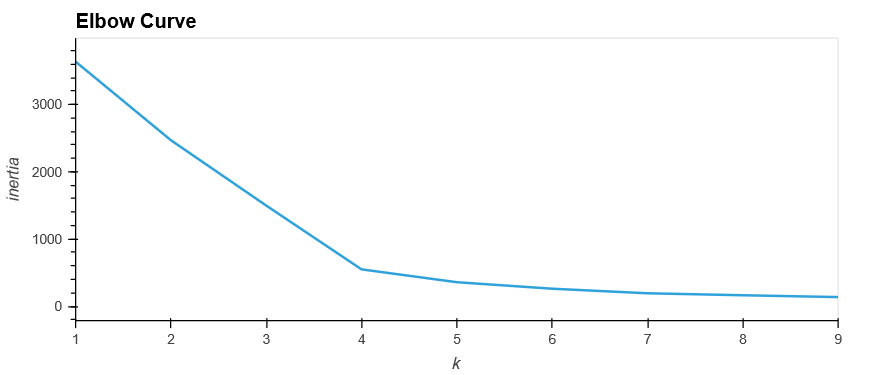
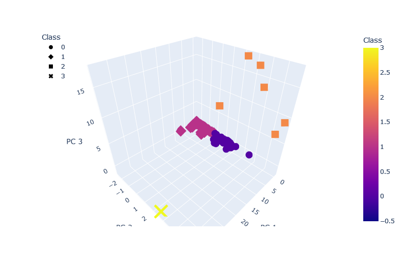
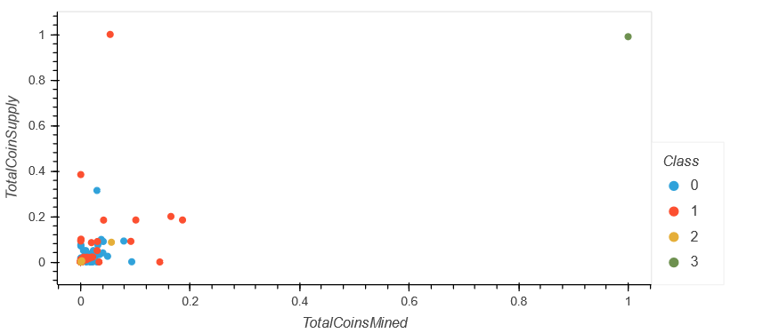

# Cryptocurrency Investment Analysis

## Overview
This project uses Python's Sci-Kit Learn and Pandas libraries to create a classification system for cryptocurrencies for investment analysis and planning.  We use K-Means clustering, an unsupervised machine learning algorithm, to determine these classifications.

## Clustering in Action
### Preprocessing
Before we can begin working with any machine learning, we must ensure our data is in a format the machine can understand.  This means removing null and non-numerical values, as well as filtering out irrelevant information.  For example, the name of a cryptocurrency does not help to classify it's investment potential, nor is there a way to meaningfully convert it to a number.  The algorithm each currency uses, however, is important, so we use Pandas' `get_dummies()` method to create columns indicating whether or not a currency uses each algorithm available.

### PCA
When we use `get_dummies()`, however, we create many additional columns.  Too many to get clear results from, even.  We use the Principal Component Analysis (PCA) algorithm to reduce the number of dimensions we're working with to three.  Fortunately, Sci-Kit Learn has a built-in PCA function, so we simply use `pca = PCA(n_components = 3, random_state = 1).fit_transform(X_scaled)` to get the components we need.

### K-Means Clustering
K-means clustering generates *K* clusters, generated by finding the *mean* of each cluster.  Instead of finding the best value for K through trial and error, we can generate an elbow plot by using the *inertia*, similar to variance, of datasets using a range of K values.  Our code to generate such a plot is shown here:
``` Python
# Create an elbow curve to find the best value for K.
inertia = []
k = list(range(1, 10))

# Calculate the inertia for the range of K values
for i in k:
    km = KMeans(n_clusters=i, random_state=0)
    km.fit(pcs_df)
    inertia.append(km.inertia_)
    
# Plot
elbow_data = {'k':k, 'inertia': inertia}
df_elbow = pd.DataFrame(elbow_data)
df_elbow.hvplot.line(x='k', y='inertia', xticks = k, title="Elbow Curve")
```

Again, sklearn really helps us avoid getting too lost in the math here.  The elbow plot made from that code is below:



In this instance, we see a defined elbow at 4, so that's our K value.  The resulting classifications can be added to a DataFrame, and are shown graphically here:



Unfortunately, the principal components are made for computers, not for people, so they don't tell us too much.  Fortunately, we can simply add the classes to our original DataFrame and use that.  We can then compare the total number of coins to the number of coins that have already been mined, while representing class as well, as shown here:


